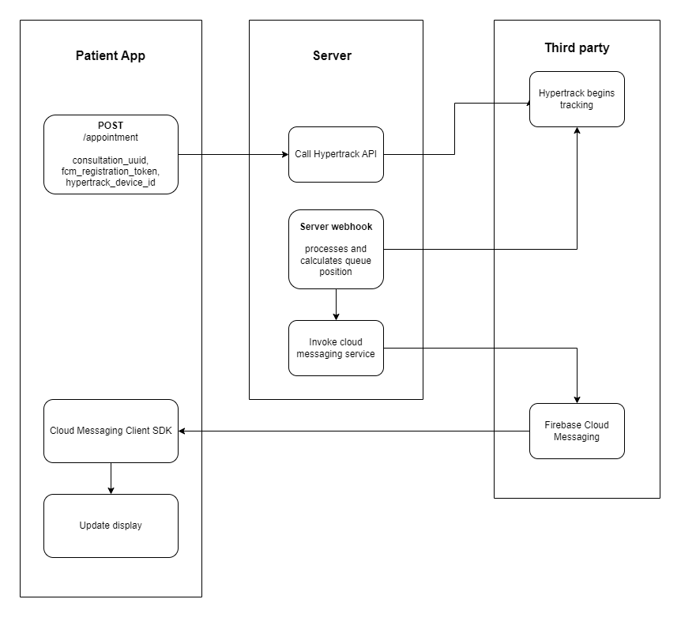

# MyDoctor Backend

Source for the backend of the app 'MyDoctor'. This backend is a RESTful service that exposes an underlying in-memory sqlite database.
The sqlite database can be easily switched to a mysql or postgres DBMS in the future.

Developed for a mini-project as part of my TY IT Course.

## Deployment

> TODO

## Running locally

The following are terminal commands for a windows system. Translate to your system as needed.

```
git clone 'this_repo'
npm i
```

Create a copy of `.env.sample` and name it `.env` \
Fill in the environment variables

```
npm run build
npm start
```

> Use `npm run dev` for development purposes. Nodemon is used and node debuggers are enabled

---

# Documentation

## Objects and Resources

```ts
interface DoctorLoginAttempt {
	email: string
	pass: string
}
```

```ts
interface DoctorLoginResponse {
	success: boolean
	reason: 'EMAIL_NON_EXISTENT' | 'WRONG_EMAIL' | 'WRONG_PASS'
}
```

```ts
interface Doctor {
	uuid: string
	email: string
	name: string
	photo: string // URL in base64 encoding
	medical_certificate: string // URL in base64 encoding
}
```

```ts
interface Clinic {
	uuid: string
	name: string
	address: string
	geolocation: {
		lat: number // float
		long: number // float
	}
}
```

```ts
// This resource maps a many-to-many relationship between Doctor and Clinic resource
interface Consultation {
	uuid: string
	doctor_uuid: string
	clinic_uuid: string
	start_time: Time
	end_time: Time
}
```

```ts
// This resource maps a one-to-many relationship between Consultation and Appointment resource
interface Appointment {
	uuid: string
	consultation_uuid: string
	fcm_registration_token: string // from firebase cloud messaging SDK
	hypertrack_device_id: string // from hypertrack SDK
}
```

```ts
// This object is sent by the Cloud Messaging module from the backend to the client
interface QueueStatus {
	size: number
	position: number
	eta: number // time in seconds;
}
```

### Relationships

> TODO

## API End-points

General guidlines:

-   All resources have a UUID to identify them
-   Resource respresentations returned by the API will often contain its UUID
-   Resouce creation requests or POST requests need not contain the UUID of the resource to be created in the request body. They are ignored if provided.
-   The http verbs are `POST`, `GET`, `PUT`, `DELETE` for Create, Read, Update and Delete
-   No authentication is implemented currently

> The API design is uniform. Request patterns, response patterns are very intuitive. Explicit documentation for the first few end-points is provided. Thereafter, only end-points names are given. Exceptions are explicity documented too.

---

### `/doctor`: Represents the `Doctor` resource

|                                              |                                                                                                                                                                                                                                                                                       |
| -------------------------------------------- | ------------------------------------------------------------------------------------------------------------------------------------------------------------------------------------------------------------------------------------------------------------------------------------- |
| **(GET) Read requests**                      |                                                                                                                                                                                                                                                                                       |
| `GET /doctor/{uuid}`                         | Returns a `Doctor` object with the UUID                                                                                                                                                                                                                                               |
| `GET /doctor/list`                           | Returns an array of `Doctor` objects                                                                                                                                                                                                                                                  |
| `GET /doctor/list/?belongs-to-clinic={uuid}` | Returns an array of `Doctor` objects that belong to the clinic with the specified UUID                                                                                                                                                                                                |
| **(POST) Create requests**                   |                                                                                                                                                                                                                                                                                       |
| `POST /doctor`                               | Creates a doctor resource. Expects a `Doctor` object (without the UUID) in the request body. Returns the created `Doctor` object (with the UUID)                                                                                                                                      |
| **(PUT) Update requests**                    |                                                                                                                                                                                                                                                                                       |
| `PUT /doctor/{uuid}`                         | Updates a doctor resource. Expects fields from the `Doctor` object in the request body. Returns the updated `Doctor` object.                                                                                                                                                          |
| **(DELETE) Delete requests**                 |                                                                                                                                                                                                                                                                                       |
| `DELETE /doctor/{uuid}`                      | Deletes the specified doctor resource                                                                                                                                                                                                                                                 |
| **Functions**                                |                                                                                                                                                                                                                                                                                       |
| `POST /doctor/login`                         | Expects a `DoctorLoginAttempt` object in request body. Returns a `DoctorLoginResponse` object. Since authentication is not implemented currently, only validity of the login credentials is checked. In the future, an auth token could be added to the `DoctorLoginResponse` object. |
| `POST /doctor/logout`                        | Since authentication is not implemented currently, this method does not do anything.                                                                                                                                                                                                  |

### `/clinic`: Represents the `Clinic` resource

| (GET) Read requests                   | (POST) Create requests | (PUT) Update requests | (DELETE) Delete requests |
| ------------------------------------- | ---------------------- | --------------------- | ------------------------ |
| `GET /clinic/{uuid}`                  | `POST /clinic`         | `PUT /clinic/{uuid}`  | `DELETE /clinic/{uuid}`  |
| `GET /clinic/list`                    |                        |                       |                          |
| `GET /clinic/list/?has-doctor={uuid}` |                        |                       |                          |

### `/consultation`: Represents the `Consultation` resource

| (GET) Read requests                                                         | (POST) Create requests | (PUT) Update requests      | (DELETE) Delete requests      |
| --------------------------------------------------------------------------- | ---------------------- | -------------------------- | ----------------------------- |
| `GET /consultation/{uuid}`                                                  | `POST /consultation`   | `PUT /consultation/{uuid}` | `DELETE /consultation/{uuid}` |
| `GET /consultation/list`                                                    |                        |                            |                               |
| `GET /consultation/list/?at-clinic={clinic_uuid}&with-doctor={doctor_uuid}` |                        |                            |                               |

### `/appointment`: Represents the `Appointment` resource

| (GET) Read requests                             | (POST) Create requests | (PUT) Update requests     | (DELETE) Delete requests     |
| ----------------------------------------------- | ---------------------- | ------------------------- | ---------------------------- |
| `GET /appointment/{uuid}`                       | `POST /appointment`    | `PUT /appointment/{uuid}` | `DELETE /appointment/{uuid}` |
| `GET /appointment/list`                         |                        |                           |                              |
| `GET /appointment/list/?at-consultation={uuid}` |                        |                           |                              |

## Implementation details

### Integration with FCM and Hypertrack


